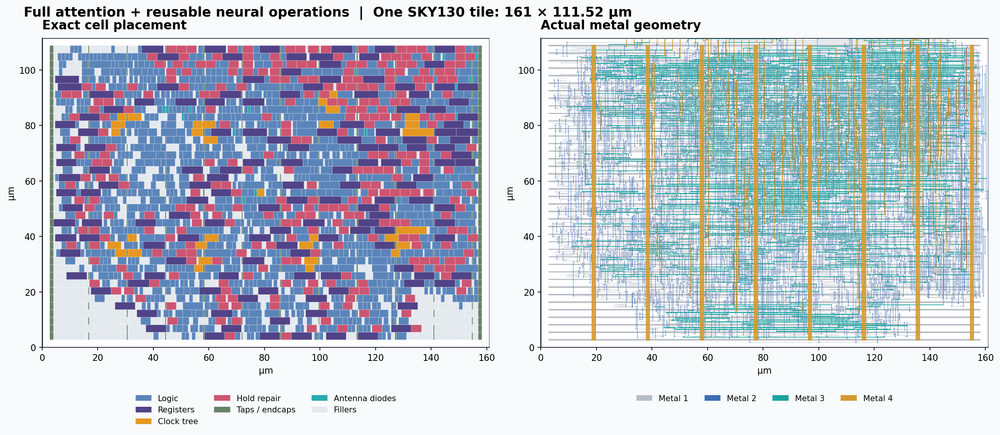

# ECE 298A: Single-tile attention accelerator

Full engineering report - 25 September 2026

## Single-tile attention accelerator

ECE 298A | Engineering report | 25 September 2026

A host-streamed INT8 attention engine with reusable linear and normalization operations, implemented in one SKY130 high-density standard-cell tile. This report consolidates routed-layout measurements, fresh static-timing and vectorless-power analysis, functional verification, and pretrained SmolLM2 integration results.

| Metric | Result | Evidence class |
|---|---|---|
| Tile footprint | 161 x 111.52 um; 0.017955 mm2 | Routed geometry |
| Non-filler cell area | 13,865.80 um2 | Placed cells |
| Tile / placement-core occupancy | 77.226% / 84.069% | Geometric utilization |
| Registers / total instances | 148 / 2,597 including fillers | Netlist / layout |
| Reference operating clock | 10 MHz | Prior timing-checked target |
| Conditional worst-corner fmax | 45.06 MHz | Static timing; not silicon |
| Typical power, 10 MHz, activity 0.1 | 0.1587 mW | Vectorless estimate |
| Safe full-range attention shape | 128 keys x 64 dimensions | Bounded RTL verification |

### Verdict

The fixed candidate fits the one-tile geometry and passes the available physical checks. Full attention runs through RTL during pretrained SmolLM2 generation. One complete pretrained decoder block is also executable, but quantizing all 30 blocks with the tested scheme produces garbled output. Functional agreement with an integer reference is not proof of model-quality preservation.

This is a custom feasibility implementation, not a completed shuttle sign-off or a fabricated chip measurement. There is no on-chip tensor SRAM. The model weights, tensors, and execution scheduling are external. Power and maximum frequency remain conditional estimates, not lab measurements.

## Architecture and numerical contract

One datapath, many sequential operations

The complete attention operation is O = softmax(Q K^T / sqrt(d_k)) V. All three arithmetic stages execute in the core. Heads and layers are time-multiplexed rather than replicated in silicon.

| Stage / extension | What the circuit does |
|---|---|
| Scores | Serial INT8 multiply-accumulate; maximum-score tracking. Scores are recomputed for the exponential pass. |
| Approximate softmax | Power-of-two scaling; small exponential lookup; denominator accumulation. The host caches emitted weights and replays them unchanged. |
| Weighted output | Unsigned weight x signed V accumulation; integer normalization division. |
| Linear operations | Expose MAC and saturating, shifted INT8 output for projections, residuals, gating and RoPE multiply-adds. |
| RMS normalization | Sum of squares; integer square root via successive odd-number subtraction; normalization; learned gamma in a following multiply. |
| Activations | Two-entry attention approximates SiLU and other nonlinearities using the existing datapath. |

Fixed implementation: norm_odd.v, NB=7, DB=6, SERIAL=1. Shared accumulator and weighted accumulator: 23 bits; maximum-score register: 22 bits; denominator: 15 bits; returned arithmetic codes: 8 bits. The serial multiplier takes eight internal multiply steps plus command and operand-transfer cycles.

### Interface and host responsibilities

The byte input carries commands/operands; send and cmd select transactions. ready, valid and kind identify acceptance and output type. Commands 0-8 cover reset-of-operation, scale load, signed MAC, max update, exponent output, weighted MAC, normalized output, requantized output and square root. The host schedules loops and eligible causal tokens, stores tensors, supplies quantization scales and RoPE constants, and acknowledges returned bytes.

In the full-block LLM experiment, token embeddings and the final vocabulary projection still execute on the CPU. Quantization, scale bookkeeping, cache storage, coefficient generation and sign/operand packing also remain host work. This is a hybrid system, not a stand-alone LLM chip.

RMS uses floor(sqrt(sum(x^2))) with a minimum denominator of one; floating-point epsilon is not reproduced. Attention exponentials and normalization are approximations. Long full-range vectors can overflow: the advertised attention bound does not guarantee arbitrary 576- or 1,536-wide INT8 operations are safe.

## Area and utilization

Physical occupancy, not the earlier 60% synthesis screen

| Cell category | Count | Area (um2) | Tile (%) |
|---|---|---|---|
| Combinational logic and signal repair | 1046 | 6,763.99 | 37.672 |
| Registers | 148 | 3,069.19 | 17.094 |
| Endcaps | 78 | 292.78 | 1.631 |
| Well taps | 225 | 281.52 | 1.568 |
| Clock tree and loads | 32 | 407.89 | 2.272 |
| Hold repair | 301 | 3,012.89 | 16.780 |
| Antenna diodes | 15 | 37.54 | 0.209 |
| Filler cells | 752 | 2,627.52 | 14.634 |

Non-filler area is 13,865.7984 um2: 77.226% of the entire 17,954.72 um2 tile, but 84.069% of the 16,493.3184 um2 placement core. Fillers occupy 2,627.52 um2, or 15.931% of core sites. All legal row sites are occupied after filler insertion: 100% filler-inclusive core occupancy is expected and is not 100% functional-logic utilization.

There are 13,182 placement sites (338 columns x 39 rows), with 11,082 occupied by non-filler cells. The core rectangle is (2.76, 2.72) to (158.24, 108.80) um. The 2,100 filler sites cannot be treated as guaranteed routable extra logic capacity.

Synthesis plus tie mapping occupied 8,932.3168 um2. Physical implementation added a net 4,933.4816 um2 of non-filler area. Clock distribution is only 2.272% of the tile; hold repair is 16.780%. The old claim that 40% had to be reserved for clocks was not an appropriate interpretation.

Actual saved placement and metal geometry. Power and signal routing occupy metal above the cells; their projected areas must not be added to cell area as if they were disjoint floorplan regions. Routing is limited through metal 4 in this candidate.

## Timing and maximum frequency

Reloaded routed database plus nominal extracted SPEF

| Cell corner | Setup slack at 10 MHz | Hold slack | Conditional fmax |
|---|---|---|---|
| TT / 1.80 V / 25 C | +85.1837 ns | +0.3346 ns | 67.49 MHz |
| SS / 1.60 V / 100 C | +77.8085 ns | +1.0584 ns | 45.06 MHz |
| FF / 1.95 V / -40 C | +86.7116 ns | +0.0418 ns | 75.25 MHz |

For these single-cycle paths and fixed I/O delays, the zero-setup-slack period is T_min = 100 ns - setup slack. f_max = 1000 / T_min in MHz. A clock-period sweep rechecked the netlist, including port paths, around the limiting boundary; this is not just an extrapolation from the nominal clock.

| Slow-corner period / frequency | Setup result |
|---|---|
| 25 ns / 40 MHz | +2.8085 ns; passes setup |
| 22.2 ns / 45.045 MHz | +0.0085 ns; near-zero margin |
| 22.19 ns / 45.065 MHz | Approximately -0.0015 ns; fails setup |
| 20 ns / 50 MHz | -2.1915 ns; fails setup |

### Constraints and interpretation

Constraints: maximum I/O delay 10 ns, minimum I/O delay 0 ns, input transition 1 ns, output load 0.01 pF, clock uncertainty 0.5 ns, propagated clock tree. The same nominal interconnect SPEF is used at all three Liberty corners; independent RC-min/RC-max corners, OCV and crosstalk sign-off were not performed. Thirteen constant tie-output endpoints were previously reported unconstrained.

The slow-corner limiting setup path is register-to-register (_2140_ to _2075_). Worst fast-corner hold margin is only 0.0418 ns. The 45.06 MHz value is therefore a conditional STA limit, not a recommended operating point or a board clock guarantee. 10 MHz remains the prior reference target; 40 MHz is a positive-margin STA exploration, not hardware validation.

The fresh TT SPEF-reload run gives +85.1837 ns setup and +0.3346 ns hold. The earlier in-memory extraction report gave +85.9340 ns and about +0.09 ns. This report uses the fresh, consistent SPEF-reload analysis for its timing table and fmax; SS and FF reproduce the archived values. The TT discrepancy remains a flow-consistency item to reconcile before sign-off; neither run changes the worst-corner limit.

Maximum transition and capacitance violation reports are empty at 10 MHz for all three reloaded corners. The frequency sweep checks setup/hold; it is not a complete higher-frequency sign-off covering pulse width, power integrity or the shuttle clock/interface.

## Power estimate and assumptions

Vectorless, standard-cell-block estimate; not measured consumption

Power was recomputed on the routed database with the nominal SPEF and Liberty internal-power and leakage models at 10 MHz. Non-clock pins are assigned uniform activity alpha and high-state probability 0.5; alpha means transitions per clock period. Clock activity remains enabled. These are sensitivity scenarios, not activity measured from the LLM waveform.

| Activity alpha | TT (mW) | SS (mW) | FF (mW) |
|---|---|---|---|
| 0 | 0.109103 | 0.092296 | 0.127450 |
| 0.05 | 0.133881 | 0.111918 | 0.156206 |
| 0.1 | 0.158659 | 0.131540 | 0.184963 |
| 0.2 | 0.208215 | 0.170784 | 0.242476 |

### Typical-corner breakdown at alpha = 0.1

| Component | Power |
|---|---|
| Internal cell power | 101.632 uW |
| Net switching power | 57.021 uW |
| Library-model leakage | 5.565 nW |
| Total | 158.659 uW = 0.1587 mW |

At this scenario, the reported sequential, combinational and clock groups are approximately 69.15, 38.91 and 50.59 uW. Clock-group power excludes clock-related internal power counted within sequential cells. Alpha = 0 still consumes about 109.10 uW at TT because the clock continues toggling; it is not powered-off or clock-gated standby.

The SS leakage estimate is approximately 7.31 uW, much higher than the TT estimate of 5.56 nW. These are strongly corner-dependent Liberty-model values, not measurements. Across the sampled scenarios the block total ranges from about 0.092 to 0.242 mW; this range is not a guaranteed min/max consumption envelope.

### What is excluded

The full Tiny Tapeout harness, package and I/O pad drivers, external memories, host computer, bridge interface and board regulators are not modeled. No IR-drop, electromigration, thermal or measured workload/VCD-based power analysis was completed. Uniform activity does not model state-dependent idle behavior or data correlations and is not a glitch-resolved gate-delay simulation.

The original SS multi-scenario log ended before its alpha=0.2 table. That point was rerun in isolation and completed successfully; its separate log is included. No missing point was interpolated. Tool command semantics are documented at https://opensta.readthedocs.io/en/latest/Commands/ (set_power_activity).

## Functional and pretrained-model verification

Arithmetic correctness and model quality are separate results

| Test | Observed result |
|---|---|
| Physical / gate-level toy block | 16 stages, 2,580 outputs, 240,087 cycles; exact integer-reference match. |
| Verilator vs Icarus bridge check | Same outputs and 63,302 cycles; includes 576/1,536-wide dot products, RMS, real attention and SiLU. |
| All SmolLM2 attention heads | 24 generated tokens / 3 prompts; 518,400 checked outputs and 45,630 weights; exact integer-reference match. |
| One complete pretrained block | 24 generated tokens / 3 prompts; 391,680 checked arithmetic outputs; coherent but changed continuations. |
| All 30 pretrained blocks | 4 generated tokens / 1 prompt in RTL; 1,571,328 checked arithmetic outputs; garbled text despite exact reference agreement. |

All RTL paths also match the separate integer model in all 49,152 final logits at every tested generation step. RTL-returned values feed subsequent operations; software reference arithmetic is an assertion oracle, not a substitute in the hardware data path. SmolLM2-135M-Instruct has 30 layers, hidden width 576, intermediate width 1,536, 9 query heads, 3 KV heads and head dimension 64.

Example: all-attention offload continued "The capital of France is" with "Paris. Paris is the political, cultural...". The all-block experiment continued "Hello" with "inying whoinis". The full-block quantization is a quality failure; no faithful full-model deployment is claimed. The three short prompts and overlapping calibration topics are not a held-out model benchmark.

### Range and precision failures

| Directed full-range input | Desired output | RTL output |
|---|---|---|
| 1,536 products of 127 x 127; output shift 17 | 127 | -3 |
| 576 inputs of 127; RMS numerator factor 384 | 16 | 51 |

These intentional range tests expose accumulator wraparound. The actual all-block trace stayed within the checked completed-sum range: maximum absolute linear sum 204,916 and maximum RMS square sum 2,301,595, below the signed 23-bit limit of 4,194,303. Safe arbitrary-input deployment needs range constraints or tiled/multi-pass arithmetic. The poor full-model text is reproduced without those checked range violations.

A separate earlier toy logistic-classifier RTL demonstration performed prediction and learning updates with host-resident weights. It is not LLM training. Likewise, synthetic decoder-block success does not establish pretrained-model accuracy. Complete formal equivalence and exhaustive end-to-end verification have not been performed.

## Throughput and system implications

Cycle-derived core time, excluding host communication and CPU work

| RTL offload path | Cycles | Core time at 10 MHz | Generated-token rate |
|---|---|---|---|
| All attention | 103,235,324 | 10.324 s | 2.325 tokens/s |
| First complete block | 1,183,981,432 | 118.398 s | 0.203 tokens/s |
| All 30 complete blocks | 4,729,280,732 | 472.928 s | 0.00846 tokens/s |

The first two measurements each produced 24 generated tokens across three prompts, with 30 processed input positions including prefill. The all-block sample produced four tokens from four processed positions. Rates above use generated tokens divided by all measured core time; they include the respective prompt-processing workload. They are not simulator wall-clock speed or end-to-end system TPS.

All-attention contexts ranged from 1 to 12 tokens. Its 2.325 tokens/s average is not a 128-token-context figure. Attention latency grows with context; prefill repeats attention for every query position. The full-block short-context trace averaged 118.232 s per generated token, or roughly two minutes before communications and remaining host computation.

One processed position through the first-block test averaged about 3.947 s of core time; this differs from 4.933 s per generated token because the latter includes extra prompt positions. Those denominators should not be mixed.

### Where performance is spent

The full-block trace issued 427,504,896 MAC operations. A single shared serial multiplier deliberately trades throughput for area. At most one datapath is active on one scheduled operation at a time; utilization percentages in the area section are spatial occupancy, not arithmetic duty cycle or achieved MAC efficiency.

External tensor storage keeps the silicon small but increases traffic. Commands, operand bytes and acknowledgments must be buffered and scheduled efficiently. A USB software round trip per operand would swamp core execution time. A bridge implementation and actual transport benchmark are still required; no board TPS or system energy-per-token is available.

### Demonstration scope

All-attention offload is the strongest supported LLM demonstration. A selected complete decoder block is an additional functional demonstration, with altered output quality. All-block inference requires better numerical treatment before it can be advertised as useful SmolLM2 execution. Increasing clock frequency alone cannot repair the quantization failure.

## Verification scope and reproducibility

What has passed, what remains open, and how to audit this report

| Check | Status / boundary |
|---|---|
| Detailed routing / antenna | Zero reported routing and antenna violations in saved run6. |
| Available KLayout rule deck | Zero reported items; not a claim that every foundry rule is implemented. |
| Layout versus schematic | Extracted circuit matches the reference netlist. |
| Power / ground connectivity | Checked connected in the physical feasibility flow. |
| Setup / hold | Positive at 10 MHz in three cell corners with nominal interconnect; conditional fmax sweep added here. |
| Power | Fresh vectorless estimate only; no fabricated or workload-measured power. |
| Official shuttle sign-off | Not established; reproduce in approved PDK/flow, with actual integration constraints. |

Remaining work: resolve the TT extraction/reload timing difference; run complete RC/PVT/variation and pulse-width checks; recheck the 41.8 ps fast-corner hold margin; validate reset/interface behavior on the target board; characterize realistic switching and power integrity; enforce long-vector range safety; improve full-block quantization; and benchmark the external memory/bridge path.

### Evidence and exact artifacts

Area and physical checks: attention-extended/physical/run6/summary.json, instances.csv, GDS, routed database and SPEF. Fresh timing/power: report_ppa.tcl, report_ppa/results.json, per-corner logs and timing reports, and the isolated SS power log. Functional results: smol-rtl-test/*-results.json and comparison-results.json. The accompanying evidence ZIP contains these reports, scripts and the two prior detailed reports, not the full PDK, tool binaries or model weights.

Reproduce fresh PPA from the existing physical-study directory with PVT_CORNER set to tt_025C_1v80, ss_100C_1v60 or ff_n40C_1v95, then run ./openroad.sh -no_init -exit report_ppa.tcl. Run report_ss_power.tcl for the isolated SS alpha=0.2 estimate. These analyses read the fixed routed design; no placement or routing changes were made for this report.

GDS SHA-256: 181551ec5180c995d46c885ce3d93c9c008721edfabeb5666af352b9bc349310

RTL SHA-256: f3b00c90734ffc413ae35499773604e2392ffba8bb40ef1dc9698f3ddc9f3548

### Primary technical references

OpenSTA command definitions: https://opensta.readthedocs.io/en/latest/Commands/ . OpenSTA power example: https://github.com/The-OpenROAD-Project/OpenSTA/blob/master/examples/power.tcl . Tiny Tapeout template: https://github.com/TinyTapeout/ttsky-verilog-template . SKY130 physical platform: https://github.com/The-OpenROAD-Project/OpenROAD-flow-scripts/tree/master/flow/platforms/sky130hd . Local model file hashes and package versions are in the saved SmolLM2 provenance.json.
